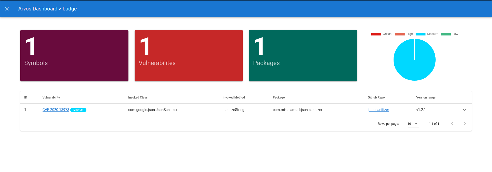

# Arvos Dashboard

A Github application that show arvos reports ( generated by github actions ) across your organization/username. 





## Limitations

- Single organization/username. Currently the dashboard requires you to specify the organization or the username of the repositories which show on the dashboard. It doesn't support multiple organizations or usernames.

## How it works

- Upon startup all repositories for the organization/username are iterated.
- Each repository is checked for workflows.
- Each workflow has it's runs listed
- The most recent run for each branch is returned.

Every 15 minutes this process is repeated. Fifteen minutes was chosen so as to not hit GitHub API limits.

When you click the refresh button in the dashboard it refreshes all runs associated with that workflow across all branches. This is refreshed server side so that other consumers of the dashboard also see the update prior to the refresh of all data.

When a workflow_run webhook is received the the central data is updated and the update is sent to all clients to refresh their displays via websockets.

## Setup GitHub App

The dashboard runs as a GitHub App. It does not automatically register itself as a GitHub app. Automatic registration is difficult if the dashboard is private and not exposed on the internet. Instead you need to manually setup a GitHub app for your organization or username.

Steps:

- Go into the settings for your organization or username
- Click Developer Settings
- Click GitHub Apps
- Click New GitHub App
  - Add an app name and homepage url
  - Put your endpoint in for the webhook url - This is optional. If you don't configure this the dashboard lag action status. For testing you can use https://smee.io but in production you will likely have to look at a solution like https://ngrok.com or https://inlets.dev
  - Put in a webhook secret
  - Repository Permissions:
    - Action: read-only
  - Subscribe to events:
    - Workflow run
  - Where can this GibHub App be installed: Only on this account
  - Should look like: 
  - Click Create GitHub App
- You should now be on the general settings page for the app
- Click Generate a new client secret and save off the client secret as it will disappear after you navigate off the page.
- Click Generate a private key. It will download a .pem file that you need to base64 encode.
- Should look like: 
- Change to Install App page: 
- Click Install
- You will get a permissions page like this: 
- Click install

## Configuring Dashboard

The dashboard has all of it's parameters passed via environment variables.

### Variables

- PORT - Optional, defaults to 8080. Port site should run on.
- GITHUB_USERNAME or GITHUB_ORG - Only one is valid. If both are specified GITHUB_ORG takes precedence and the GITHUB_USERNAME is ignored.
- GITHUB_APPID - The AppId from the GitHub App general settings page.
- GITHUB_APP_PRIVATEKEY - The base64 encoded private key from the GitHub App general settings page.
- GITHUB_APP_CLIENTID - The client id from the GitHub App general settings page.
- GITHUB_APP_CLIENTSECRET - The client secret from the GitHub App general settings page.
- GITHUB_APP_INSTALLATIONID - Installation id that can be retrieved using steps in the next section.
- GITHUB_APP_WEBHOOK_SECRET - Optional. If you don't supply the dashboard will not setup webhooks and only update every 15 minutes.
- GITHUB_APP_WEBHOOK_PORT - Optional, defaults to 8081. If set to the same as PORT must also specify GITHUB_APP_WEBHOOK_PATH
- GITHUB_APP_WEBHOOK_PATH - Optional if WebHooks running on different port than main site, defaults to /, if running on the same port defaults to /webhook.
- LOOKBACK_DAYS - Optional, defaults to 7. Number of days to look in the past for workflow runs.
- DEBUG=action-dashboard:\* - Optional setting to help in debugging

### Installation Id

GitHub doesn't make the installation id super obvious in the UI. Here is how to obtain the installation id.

- Go into the settings for your organization or username
- Click Developer Settings
- Click GitHub Apps
- Click Configure on GitHub Action Dashboard
- In the URL, the digits after the slash are your installation id.

Alternatively I have provided a utility to obtain the installation id. You will need all the variables from the previous section with the exception of GITHUB_APP_INSTALLATIONID set to do this.

#### Option 1

Requires docker installed locally.

```bash
docker run --rm -t --env GITHUB_USERNAME=XXXXXXX --env GITHUB_APPID=XXXXXX --env GITHUB_APP_PRIVATEKEY=XXXXXXXXXXXXXXXXXXX --env GITHUB_APP_CLIENTID=XXX.XXXXXXXXXXXXXXXX --env GITHUB_APP_CLIENTSECRET=XXXXXXXXXXXXXXXXXXXXXXXXXXXXXXX ghcr.io/chriskinsman/github-action-dashboard:edge node getinstallationid.js
```

#### Option 2

Requires nodejs installed locally.

```bash
npm ci
GITHUB_USERNAME=XXXXXXX GITHUB_APPID=XXXXXX GITHUB_APP_PRIVATEKEY=XXXXXXXXXXXXXXXXXXXXX GITHUB_APP_CLIENTID=XXX.XXXXXXXXXXXXXXXX GITHUB_APP_CLIENTSECRET=XXXXXXXXXXXXXXXXXXXXXXXXXXXXXXX node getinstallationid.js
```

## Running Dashboard

#### Option 1

Requires docker installed locally.

```bash
docker run --rm -td -p 8080:8080 --env GITHUB_USERNAME=XXXXXXX --env GITHUB_APPID=XXXXXX --env GITHUB_APP_PRIVATEKEY=XXXXXXXXXXXXXXXXXXXXXXXXXXXXX --env GITHUB_APP_CLIENTID=XXX.XXXXXXXXXXXXXXXX --env GITHUB_APP_CLIENTSECRET=XXXXXXXXXXXXXXXXXXXXXXXXXXXXXXX --env GITHUB_APP_INSTALLATIONID=XXXXXXX ghcr.io/chriskinsman/github-action-dashboard:edge node index.js
```

#### Option 2

Requires nodejs installed locally.

```bash
npm ci
cd client
npm ci
npm run build
cd ..
GITHUB_USERNAME=XXXXXXX GITHUB_APPID=XXXXXX GITHUB_APP_PRIVATEKEY=XXXXXXXXXXXXXXXXXXXXXXXXXXXXXX GITHUB_APP_CLIENTID=XXX.XXXXXXXXXXXXXXXX GITHUB_APP_CLIENTSECRET=XXXXXXXXXXXXXXXXXXXXXXXXXXXXXXX GITHUB_APP_INSTALLATIONID=XXXXXXX node index.js
```

Open your browser to http://localhost:8080

## Debugging tips

Debugging webhooks can be hard.

Couple tips:

1. Run the full app outside vue-cli
2. Use the smee-client to proxy the webhook:

```bash
smee --port 8081
```

Then take the proxy endpoint and update your GitHub App webhook with it
